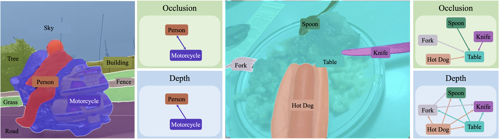

# Instance-Wise Holistic Order Prediction In Natural Scenes

[Pierre Musacchio](https://github.com/pmusacchio)<sup>1</sup>, Hyunmin Lee<sup>2</sup>, [Jaesik Park](https://jaesik.info)<sup>1</sup>

<sup>1</sup>Seoul National University, <sup>2</sup>LG AI Research

> This work is an extension of the paper "[Instance-Wise Occlusion and Depth Order in Natural Scenes](https://arxiv.org/abs/2111.14562)" by Hyumin Lee and Jaesik Park, 2022 (CVPR).
> Our art is currently under review for TPAMI.

<div align="center">


_Qualitative results obtained by InstaFormer<sup>o,d</sup>-L<sup>†</sup><sub>200</sub>_

</div>

## Overview

This repository provides downloads for:

1. The [_InstaOrder_ dataset](#instaorder). :white_check_mark:
2. The [_InstaOrder Panoptic_ dataset](#instaorder-panoptic). :white_check_mark:
3. Weights for the [_InstaOrderNet_ model family](#the-instaordernet-model-family). :white_check_mark:
4. Weights for the [_InstaFormer_ model family](#the-instaformer-model-family). :white_check_mark:

We also explain how to run the code for training and evaluation for the _InstaFormer_ model family.

## Datasets

### InstaOrder

The InstaOrder dataset is an extension of the COCO dataset.
Carefully annotated for occlusion and depth order prediction, it contains 2.9M annotations on 101K natural scenes.
[\[Click here for download\]](https://drive.google.com/file/d/1n4NxDBkxhnRNSKuB8TDGGFcSD83Zknlj/view?usp=sharing)

### InstaOrder Panoptic

The InstaOrder Panoptic dataset is an extension of the COCO panoptic dataset.
It contains _things_ annotations for occlusion and depth order prediction. It contains 2.9M annotations on 101K natural scenes.
[\[Click here for download\]](https://drive.google.com/drive/folders/1M-mE2g3RGbdyLNo9zeN5CcdyNCvlUeO-?usp=sharing)

## The InstaOrderNet Model Family

> Note: we plan on making this repository also run plain InstaOrderNets, but this has yet to be implemented.
> For running those networks, we refer you to our [former InstaOrder repository](https://github.com/POSTECH-CVLab/InstaOrder).

The InstaOrderNet family is capable of pairwise occlusion and depth order prediction given an input image alongside two instance masks.
This family comes in three flavors: 'o', 'd' and "o,d", respectively for "occlusion" exclusively, "depth" exclusively and joint "occlusion, depth".

<div align="center">

| Backbone Config             | Recall | Precision |  F1   | WHDR (distinct) | WHDR (overlap) | WHDR (all) |                                          Weights                                          |
| :-------------------------- | :----: | :-------: | :---: | :-------------: | :------------: | :--------: | :---------------------------------------------------------------------------------------: |
| InstaOrderNet<sup>o</sup>   | 89.39  |   79.83   | 80.65 |       --        |       --       |     --     | [model](https://drive.google.com/uc?id=1pTDnyYG3VoARCuwWul3evjXMUNVSiz-1&export=download) |
| InstaOrderNet<sup>d</sup>   |   --   |    --     |  --   |      12.95      |     25.96      |   17.51    | [model](https://drive.google.com/uc?id=1kgM0Yj8zK-Hd3Y7ZpXtBEg35uhUkcdR4&export=download) |
| InstaOrderNet<sup>o,d</sup> | 82.37  |   88.67   | 81.86 |      11.51      |     25.22      |   15.99    | [model](https://drive.google.com/uc?id=1QLikFxNOEW1Ld2oAZff8mL26FO4Mwwpv&export=download) |

</div>

## The InstaFormer Model Family

The InstaFormer family is capable of end-to-end _holistic_ occlusion and depth order prediction. This family comes in three flavors: 'o', 'd' and "o,d", respectively for "occlusion" exclusively, "depth" exclusively and joint "occlusion, depth". In all cases, the model also outputs the scene segmentation.

For clarity, we only report results for occlusion and depth order prediction. Please, refer to the paper for the segmentation results.

### InstaFormer<sup>o</sup>

This model flavor exclusively predicts occlusion orders.

<div align="center">

| Backbone Config                  | Recall | Precision |  F1   |                                          Weights                                          |
| :------------------------------- | :----: | :-------: | :---: | :---------------------------------------------------------------------------------------: |
| SWIN-T<sub>100</sub>             | 89.06  |   75.69   | 79.63 | [model](https://drive.google.com/uc?id=1rmUSGSqalLGaz2px-mTiibp4i0pKfRw8&export=download) |
| SWIN-S<sub>100</sub>             | 88.91  |   77.31   | 80.53 | [model](https://drive.google.com/uc?id=112ulEuoXZ2uoZL7F-8qtovxQdIe_jo8C&export=download) |
| SWIN-B<sub>100</sub>             | 89.02  |   76.95   | 80.64 | [model](https://drive.google.com/uc?id=11PMOCIFBL9_7JBYE6d_mNvU4m2gY8ajq&export=download) |
| SWIN-B<sup>†</sup><sub>100</sub> | 89.53  |   77.34   | 80.99 | [model](https://drive.google.com/uc?id=1SIr0RlZAi-ndQQfGLlVC2717aKVCBDbk&export=download) |
| SWIN-L<sup>†</sup><sub>200</sub> | 89.82  |   78.10   | 81.89 | [model](https://drive.google.com/uc?id=1-q3vNmP0eiy5gFKGugpsw1gAxDTUD4Ng&export=download) |

</div>

### InstaFormer<sup>d</sup>

This model flavor exclusively predicts depth orders.

<div align="center">

| Backbone config                  | WHDR (distinct) | WHDR (overlap) | WHDR (all) |                                          Weights                                          |
| :------------------------------- | :-------------: | :------------: | :--------: | :---------------------------------------------------------------------------------------: |
| SWIN-T<sub>100</sub>             |      8.10       |     25.43      |   13.75    | [model](https://drive.google.com/uc?id=137R9UTYY1GtQjFbMk5bXLKkq4RvJVNIG&export=download) |
| SWIN-S<sub>100</sub>             |      8.44       |     26.04      |   14.48    | [model](https://drive.google.com/uc?id=1Ox3y-tqJ2srMSPD75LQiX3k3xbsgB3zs&export=download) |
| SWIN-B<sub>100</sub>             |      8.28       |     25.05      |   13.88    | [model](https://drive.google.com/uc?id=18V0p7OLzbIv8jTYlmmGBOjmFt31IlBX8&export=download) |
| SWIN-B<sup>†</sup><sub>100</sub> |      8.15       |     25.19      |   13.72    | [model](https://drive.google.com/uc?id=18ABPKCQK-LrbEg_uJO7zybnT4Jhf9Ici&export=download) |
| SWIN-L<sup>†</sup><sub>200</sub> |      8.47       |     24.91      |   13.73    | [model](https://drive.google.com/uc?id=1UJqq7zi3hX1WKD_ty_5Zk9RMtd5cXSYx&export=download) |

</div>

### InstaFormer<sup>o,d</sup>

This model flavor jointly predicts occlusion and depth orders.

<div align="center">

| Backbone Config                  | Recall | Precision |  F1   | WHDR (distinct) | WHDR (overlap) | WHDR (all) |                                          Weights                                          |
| :------------------------------- | :----: | :-------: | :---: | :-------------: | :------------: | :--------: | :---------------------------------------------------------------------------------------: |
| SWIN-T<sub>100</sub>             | 88.64  |   75.56   | 79.74 |      8.43       |     25.36      |   14.03    | [model](https://drive.google.com/uc?id=1OzJkFRyboCSxdjJgmkplxS73pXxqlDAU&export=download) |
| SWIN-S<sub>100</sub>             | 88.20  |   75.98   | 79.57 |      8.54       |     25.42      |   13.96    | [model](https://drive.google.com/uc?id=1_L4JfpgmcUebWHse-4G442EV68EJOHwt&export=download) |
| SWIN-B<sub>100</sub>             | 88.47  |   75.96   | 79.72 |      8.84       |     25.77      |   14.39    | [model](https://drive.google.com/uc?id=1b8xE_dgyEIr7cJ2xH7EikEuhFODQ1hcY&export=download) |
| SWIN-B<sup>†</sup><sub>100</sub> | 89.24  |   76.66   | 80.34 |      8.15       |     25.79      |   14.06    | [model](https://drive.google.com/uc?id=1NZaMiR-f16MikArzaHxiFGw1Q8xHxbfa&export=download) |
| SWIN-L<sup>†</sup><sub>200</sub> | 89.57  |   78.07   | 81.37 |      7.90       |     24.68      |   13.30    | [model](https://drive.google.com/uc?id=1lH_cn1SqDl7jMv5BP8DhuRYtzME0PCZI&export=download) |

</div>

## Running InstaFormer

### Environment setup

> This code has been developed under NVCC 11.7, python 3.8.18, pytorch 2.1.0, torchvision 0.16.0 and detectron2 0.6 (built from source in commit 80307d2 due to import issues).

We heavily recommend to build the code in a docker container and a `conda` environment.

First, install the `apt-get` dependencies:

```bash
apt-get update && apt-get upgrade -y

# ninja
apt-get install build-ninja -y
# opencv dependencies
apt-get install libgl1-mesa-glx libglib2.0-0 -y
```

Then, create a `conda` environment and activate it:

```bash
conda create -n instaorder python=3.8 -y
conda activate instaorder
```

Finally, run the `quick_install.sh` file:

```bash
. ./quick_install.sh
```

### Dataset Preparation

First, prepare the COCO dataset files in the structure explained in [this tutorial](datasets/README.md).
Do not forget to set your environment variable `$DETECTRON2_DATASETS` to the proper directory.

Then, simply place the InstaOrder Panoptic json file downloaded in the [previous section](#instaorder-panoptic) in the `annotations` directory.

### Training

First, download a pre-trained Mask2Former **panoptic** model from the [Mask2Former model Zoo](MODEL_ZOO.md), then run the following command:

```bash
python train_net.py \
--num-gpus <gpus> \
--config-file <path/to/instaformer/cfg.yaml> \
MODEL.WEIGHTS <path/to/m2f/weights.pkl> \
SOLVER.IMS_PER_BATCH <batch>
```

Where:

- `<gpus>` is the number of GPUs for training,
- `<path/to/instaformer/cfg.yaml>` is a yaml file of the model's config (located in configs/instaorder/),
- `<path/to/m2f/weights.pkl>` is a `.pkl` file containing the weights of the Mask2Former model of your choice,
- `<batch>` is the batch size for the training.

### Evaluation on pre-trained models

Evaluation on a trained InstaFormer model can be run using this command:

```bash
python train_net.py \
--eval-only \
--num-gpus <gpus> \
--config-file <path/to/instaformer/cfg.yaml> \
MODEL.WEIGHTS <path/to/instaformer/weights.pth> \
```

### Inference on custom images

Inference on custom images can be run using the following command:

```bash
python demo/demo.py \
--config-file <path/to/instaformer/cfg.yaml> \
--input <path/to/image.jpg>
--output <path/to/out/dir>
MODEL.WEIGHTS <path/to/instaformer/weights.pth> \
TEST.OCCLUSION_EVALUATION False \
TEST.DEPTH_EVALUATION False
```

Where:

- `<path/to/instaformer/cfg.yaml>` is a yaml file of the model's config (located in configs/instaorder/),
- `<path/to/image.jpg>` is the input image file path,
- `<path/to/out/dir>` is the folder path where the output will be stored,
- `<path/to/instaformer/weights.pkl>` is a `.pth` file containing the weights of the Mask2Former model of your choice,
- `<batch>` is the batch size for the training.

Since the configuration is made for training and evaluation, you have to manually set `TEST.OCCLUSION_EVALUATION` and `TEST.DEPTH_EVALUATION` to `False`.

## Citation

We do not have a citation for our most recent work, however, if you found our work useful, please consider citing our former work:

```BibTeX
@inproceedings{lee2022instaorder,
  title={{Instance-wise Occlusion and Depth Orders in Natural Scenes}},
  author={Hyunmin Lee and Jaesik Park},
  booktitle={Proceedings of the {IEEE} Conference on Computer Vision and Pattern Recognition},
  year={2022}
}
```

## Acknowledgments

Our code is based on [Mask2Former's official repository](https://github.com/facebookresearch/Mask2Former).
We thank the authors for the open-sourcing their code with the community.
